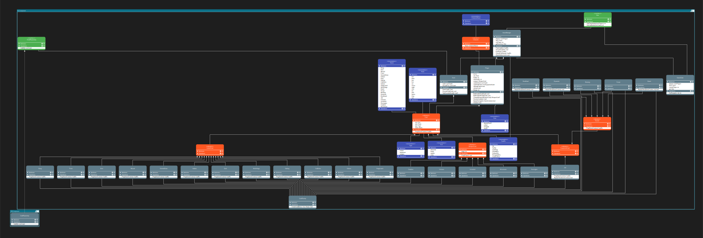

# Настольная игра «Бэнг!»

## Идея

Проект представляет собой цифровую адаптацию настольной игры «Бэнг!» в формате мультиплеерной карточной игры. Игра будет включать роли (шериф, помощник шерифа, бандит и ренегат) и карты действий.

## Предметная область

Проект относится к жанру стратегических карточных игр с элементами скрытой ролевой механики, где у игроков разные цели в зависимости от своей роли.

## ER-диаграмма

## Use-case диаграмма

## User-flow диаграмма

## Тип приложения

Приложение с графическим интерфейсом на Unity

## Разбиение на компоненты

## UML компонента доступа к данным и бизнес логики
